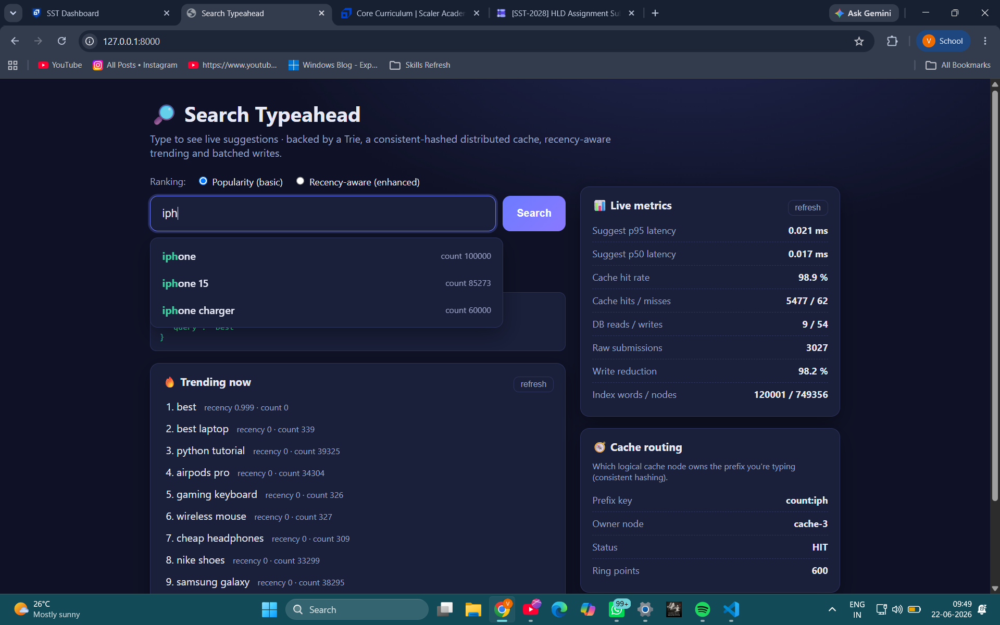
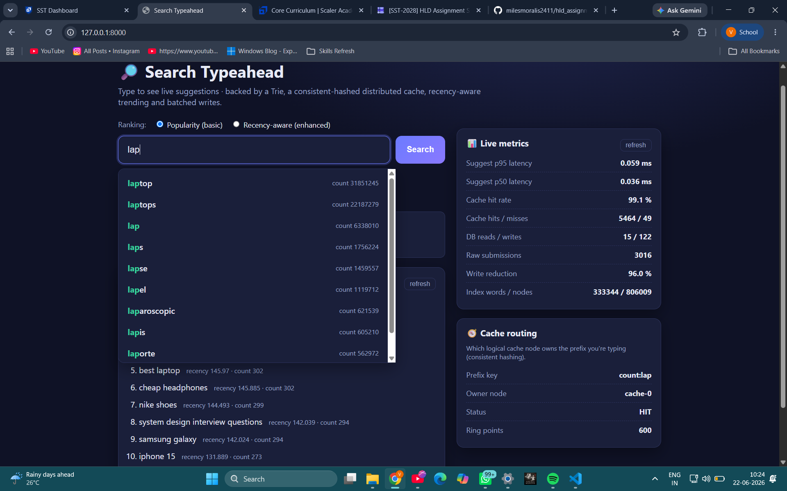
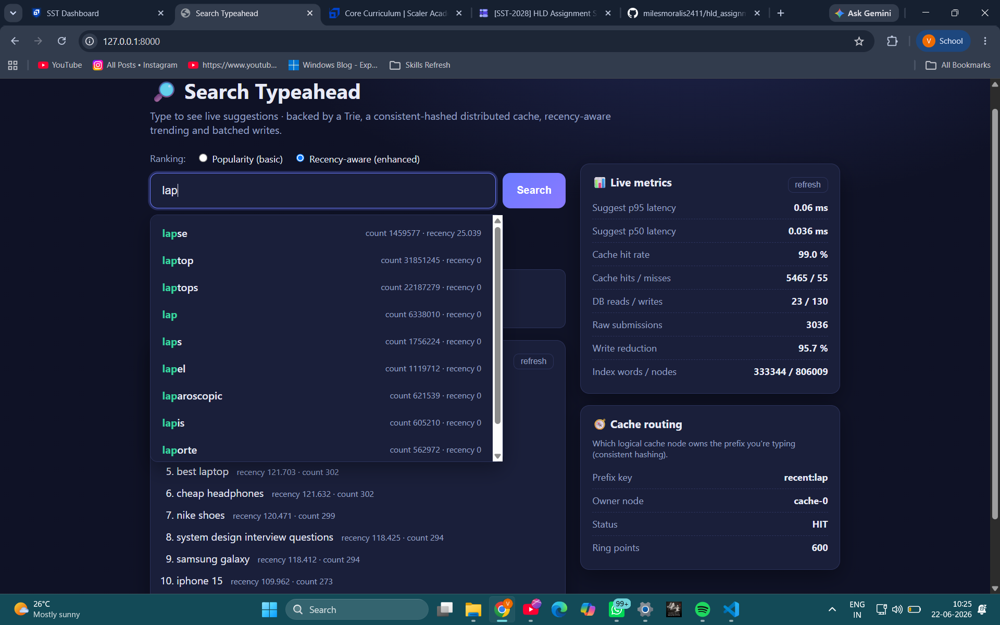
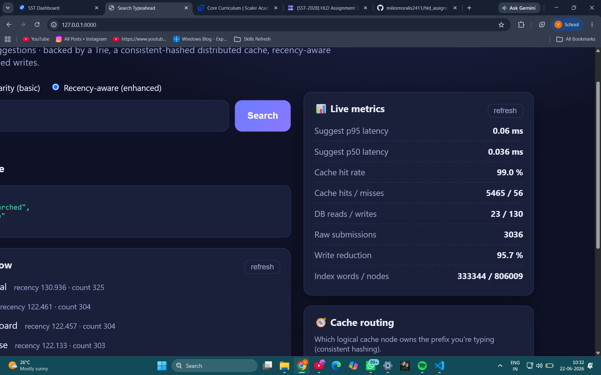

# 🔎 Search Typeahead System

A search‑as‑you‑type (typeahead) system — like the suggestion box on a search
engine or e‑commerce site. It serves popular query suggestions while you type,
accepts search submissions, updates query popularity, and is built around the
**backend data‑system design** the assignment focuses on:

- how query‑count data is **stored** (durable SQLite + in‑memory Trie index),
- how suggestions are served with **low latency** (a **distributed cache**
  fronted by **consistent hashing**),
- how **trending / recency‑aware** ranking works,
- how **write pressure is reduced** with **batched writes**.

It ships with a clean web UI, a real 333k‑keyword open dataset (auto‑downloaded),
a benchmark harness, and full docs.

---

## 1. Quick start

> Requires **Python 3.9+**. Everything runs locally; no external services.

```bash
# 1. (optional) create a virtualenv
python -m venv .venv
.venv\Scripts\activate          # Windows
# source .venv/bin/activate     # macOS/Linux

# 2. install dependencies
pip install -r requirements.txt

# 3. run (auto-downloads the real dataset + loads it on first start)
python run.py
```

Then open **http://127.0.0.1:8000** for the UI, or
**http://127.0.0.1:8000/docs** for interactive API docs.

First start takes ~10–15 s (it downloads the dataset, loads SQLite and builds the
index over 333k keywords); later starts reuse `data/typeahead.db` and are ready
in ~3–4 s.

### Measure performance

In a second terminal (with the server running):

```bash
python -m scripts.benchmark
```

This drives the server over HTTP and prints read latency (p50/p95/p99), cache
hit rate, DB read/write counts and the batch write‑reduction percentage. See
[docs/PERFORMANCE.md](docs/PERFORMANCE.md).

---

## 📸 Screenshots

**Typeahead suggestions** — prefix‑matched, count‑sorted, debounced as you type.



**Search submission** — the dummy search API returns `{"message": "Searched"}` and
the query's popularity is updated.


**Basic vs recency‑aware ranking** — same prefix, two ranking modes. In the
enhanced mode a recently searched query is boosted to the top (and the boost
decays over time, so spikes don't stay over‑ranked).





**Trending searches** — the most active queries right now via a time‑decayed counter.


**Live metrics** — suggestion p95 latency, ~99% cache hit rate, and ~98% write
reduction from batching.



**Cache routing (consistent hashing)** — which logical cache node owns the
current prefix key.


---

## 2. Architecture

```
                            ┌──────────────────────────────────────────┐
   Browser (frontend)       │                Backend (FastAPI)          │
 ┌────────────────────┐     │                                           │
 │ search box         │     │   GET /suggest ─► SuggestionService        │
 │ suggestions (debounce)───►│        │                                  │
 │ trending section   │     │        ▼                                  │
 │ metrics panel      │     │   ┌──────────────┐  miss   ┌────────────┐ │
 │ cache routing      │     │   │ Distributed  │────────►│   Trie     │ │
 └─────────┬──────────┘     │   │   Cache      │◄────────│  index     │ │
           │ POST /search   │   │ (consistent  │  fill   └─────┬──────┘ │
           ▼                │   │   hashing)   │               │ built  │
   {"message":"Searched"}   │   └──────────────┘               ▼ from   │
           │                │        ▲                   ┌────────────┐ │
           │                │        │ invalidate        │  SQLite    │ │
           ▼                │   ┌──────────────┐ flush   │ primary    │ │
     TrendingTracker  ◄─────┼───│ BatchWriter  │────────►│  store     │ │
     (decaying recency)     │   │ (buffer+agg) │         └────────────┘ │
                            └──────────────────────────────────────────┘
```

Full diagram + data‑flow walkthrough: [docs/ARCHITECTURE.md](docs/ARCHITECTURE.md).

**Read path** (`GET /suggest`): cache → on miss, Trie returns a candidate pool →
rank (by count, or by count+recency) → store result back in cache.

**Write path** (`POST /search`): record recency **immediately** (so trending
reacts instantly) and **append the count update to a buffer** (so we don't write
to the DB on every keystroke‑search). Returns `{"message": "Searched"}`.

**Flush path** (background task): drain the buffer, **aggregate repeated
queries**, persist in **one transaction**, refresh the Trie and invalidate
affected cache entries.

### Components (`app/`)

| File | Responsibility |
|------|----------------|
| `consistent_hash.py` | Hash ring with virtual nodes; routes a prefix key to a cache node |
| `cache.py` | One logical cache node: LRU + per‑entry TTL + hit/miss stats |
| `cache_cluster.py` | N cache nodes behind the ring = the distributed cache |
| `trie.py` | Prefix index; precomputes top‑N for shallow prefixes (bounded memory) |
| `store.py` | SQLite primary store; counts every DB read/write |
| `trending.py` | Exponentially time‑decayed recency scores |
| `batch_writer.py` | Buffer + aggregate + periodic/size‑based flush |
| `metrics.py` | Rolling latency window → p50/p95/p99 |
| `service.py` | Wires it all together (read/write/flush/trending/metrics) |
| `main.py` | FastAPI routes + lifespan bootstrap + static frontend |

---

## 3. API documentation

Base URL: `http://127.0.0.1:8000`

### `GET /suggest?q=<prefix>&ranking=count|recent`
Up to 10 suggestions whose query **starts with** `<prefix>`.
- `ranking=count` *(default)* — basic ranking by overall search count.
- `ranking=recent` — enhanced ranking blending count with decaying recency.

```jsonc
// GET /suggest?q=iph
{
  "prefix": "iph", "ranking": "count", "source": "store",
  "suggestions": [
    {"query": "iphone", "count": 100000},
    {"query": "iphone 15", "count": 85000},
    {"query": "iphone charger", "count": 60000}
  ]
}
```
`source` is `cache` (hit), `store` (miss → computed) or `empty`.

### `POST /search`  body `{"query": "iphone 15"}`
Dummy search. Records recency now, buffers the count increment.
```jsonc
{"message": "Searched", "query": "iphone 15"}
```

### `GET /trending`
Currently trending queries (recency‑aware).
```jsonc
{"trending": [{"query": "iphone 15", "recency_score": 4.87, "count": 85003}]}
```

### `GET /cache/debug?prefix=<p>&ranking=count|recent`
Shows **which cache node owns** the prefix key and whether it's a hit/miss —
i.e. the consistent‑hashing routing decision.
```jsonc
{
  "key": "count:iph", "key_hash": 27893…, "owner_node": "cache-2",
  "cache_status": "HIT", "total_nodes": 4, "virtual_nodes_per_node": 150,
  "total_points_on_ring": 600
}
```

### `GET /metrics`
Latency (p50/p95/p99), cache hit rate per node, DB read/write counts, batch
write reduction, index size.

### `POST /admin/flush`
Force a batch flush now (handy in demos so writes show up immediately).

### `GET /health` → `{"status": "ok"}`

---

## 4. Dataset

- **Source (real, open):** the **Google Web Trillion Word Corpus** unigram
  counts — [`count_1w.txt`](https://norvig.com/ngrams/) published by Peter Norvig.
  It contains **333,333 real keywords with real corpus frequencies**, free to
  use. ("Keywords" is one of the entry types the assignment explicitly allows.)
- **Size:** all **333,333** rows by default (≫ the 100k minimum). Cap it with
  `TYPEAHEAD_DATASET_LIMIT` or `--limit` (the file is sorted by descending
  frequency, so a limit keeps the most popular keywords).
- **Format:** the raw file is `word<TAB>count`; the loader converts it to the
  assignment's `query,count` CSV at `data/queries.csv`.

**Loading instructions.** It is fetched and loaded **automatically on first
run** (`python run.py`) — no manual step needed, just internet access the first
time. To do it explicitly:
```bash
python -m scripts.download_dataset            # -> data/queries.csv (all rows)
python -m scripts.download_dataset --limit 150000   # top-150k by frequency
```

**Use a different dataset?** Drop any `query,count` CSV at `data/queries.csv`
(e.g. an AOL query log or a Kaggle e‑commerce search‑terms set) and delete
`data/typeahead.db` so it reloads. If your file has no counts, aggregate
duplicate rows into counts first. The loader ([`app/loader.py`](app/loader.py))
tolerates files with or without a header.

**Offline?** If the download can't reach the network on first run, the app falls
back to a reproducible synthetic generator ([`app/dataset.py`](app/dataset.py))
so it still runs; a message is printed when this happens.

---

## 5. Design choices & trade‑offs

**In‑memory Trie + bounded precomputation.** Suggestions need top‑K completions
of a prefix. A Trie gives O(prefix length) traversal. The catch is broad
prefixes ("a", "ip") that fan out to huge subtrees. We **precompute a top‑N
candidate pool only for shallow nodes** (`precompute_depth`, default 4) so those
expensive lookups are O(1), and compute deep prefixes on demand (their subtrees
are tiny). This bounds memory (we don't store a list on all ~1M nodes) while
keeping latency low everywhere. *Trade‑off:* a recency‑surging query with a very
low count may not be in a broad prefix's pool until its count rises — acceptable
because (a) searching it also raises its count, and (b) it still shows in the
trending section.

**Distributed cache via consistent hashing.** Each prefix‑ranking key
(`count:iph`) is routed by a consistent‑hash ring to one of N logical cache
nodes (LRU + TTL). Modelled in‑process so it stays one‑command‑runnable, but the
behaviour is real: even key spread (150 virtual nodes/node), per‑shard stats,
and minimal remap if a node is added. *Trade‑off:* TTL means suggestions can be
briefly stale after a write; we additionally invalidate the changed query's
short prefixes on flush to tighten this.

**Recency without permanent bias.** Trending uses an **exponentially decayed
counter** per query (`score = score·0.5^(Δt/half_life) + 1`). It reacts instantly
to bursts but the boost **fades on its own**, so a short‑lived spike doesn't stay
over‑ranked forever. O(1) per update, no sliding‑window buffers to sweep. The
enhanced ranking blends it as `final = log1p(count) + recency_weight·recency` —
log‑compressing popularity so recency stays meaningful whether counts are in the
tens or the billions (the real dataset's counts reach ~2.3×10¹⁰).
*Trade‑off:* `half_life` and `recency_weight` are tunables that balance freshness
vs. stability (see `app/config.py`).

**Batched writes.** `POST /search` never writes to the DB synchronously — it
buffers. A background flusher drains on size or interval and **aggregates
repeated queries** (50× "iphone" → one `+50` row‑write). This collapses many
writes into few. *Failure trade‑off:* the buffer is in‑memory, so a crash before
a flush loses un‑flushed submissions. Mitigations (not enabled, to keep write
latency low): a durable append‑only log / persistent queue (Kafka, fsync'd WAL).
On **graceful shutdown** we flush the remaining buffer.

**Why SQLite + FastAPI?** Zero‑setup ("easy to run locally") but a real
transactional store and a real async HTTP framework with auto‑generated API
docs. The access pattern maps cleanly onto any RDBMS / Redis if scaled out.

All tunables live in [`app/config.py`](app/config.py) and are overridable via
environment variables.

---

## 6. How this maps to the assignment

| Requirement | Where |
|---|---|
| Typeahead suggestions, ≤10, prefix‑matched, count‑sorted | `service.suggest`, `trie.suggest`, `GET /suggest` |
| Empty / missing / mixed‑case handled; debounced UI | `service.normalize`, `frontend/app.js` (130 ms debounce) |
| Search submission updates query‑count; returns `"Searched"` | `service.submit_search`, `POST /search` |
| Query‑count storage + caching for low latency | `store.py`, `cache_cluster.py` |
| Distributed cache with **consistent hashing** | `consistent_hash.py`, `cache_cluster.py`, `GET /cache/debug` |
| **Trending** (basic count + enhanced recency) | `trending.py`, `ranking=recent`, `GET /trending` |
| **Batch writes** (buffer, aggregate, flush, failure discussion) | `batch_writer.py`, §5 above |
| UI (box, dropdown, submit, response, trending, loading/error, keyboard) | `frontend/` |
| Non‑functional: p95 latency, cache hit rate, DB read/write counts | `GET /metrics`, `scripts/benchmark.py` |
| Suggested milestones 1–7 | all of the above; see [docs/ARCHITECTURE.md](docs/ARCHITECTURE.md) |

**Grading rubric coverage:** Basic implementation (dataset, UI, suggestions,
search, query‑count, consistent‑hashed distributed cache) = 60; Trending
(count + recency, windowing/decay, explanation) = 20; Batch writes (buffering,
aggregation, write‑reduction evidence, failure trade‑offs) = 20.

---

## 7. Configuration

Override any of these via environment variables (see `app/config.py`):

| Variable | Default | Meaning |
|---|---|---|
| `TYPEAHEAD_DATASET_LIMIT` | `0` | rows from the real dataset (0 = all 333,333) |
| `TYPEAHEAD_DATASET_SIZE` | `120000` | size of the offline synthetic fallback |
| `TYPEAHEAD_CACHE_NODES` | `4` | logical cache nodes |
| `TYPEAHEAD_VNODES` | `150` | virtual nodes per cache node |
| `TYPEAHEAD_CACHE_TTL` | `30` | cache entry TTL (s) |
| `TYPEAHEAD_BATCH_SIZE` | `200` | flush when buffer reaches this |
| `TYPEAHEAD_FLUSH_INTERVAL` | `2.0` | flush at least this often (s) |
| `TYPEAHEAD_RECENCY_HALFLIFE` | `300` | recency decay half‑life (s) |
| `TYPEAHEAD_RECENCY_WEIGHT` | `6` | recency weight (blended vs log1p(count)) |
| `TYPEAHEAD_PRECOMPUTE_DEPTH` | `4` | precompute candidate pools up to this prefix depth |

---

## 8. Project layout

```
app/         backend (FastAPI + data-system components)
frontend/    static UI (HTML/CSS/JS)
scripts/     dataset download, loader, benchmark
docs/        architecture + performance report
images/      UI screenshots (used in this README)
data/        downloaded dataset + SQLite db (gitignored)
run.py       entry point
```
