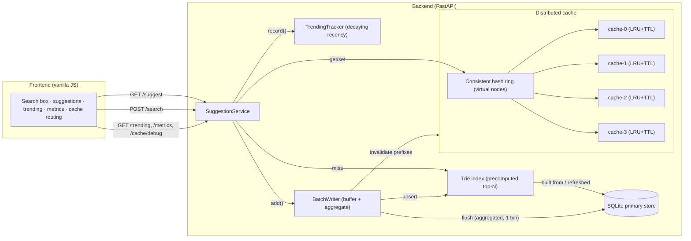
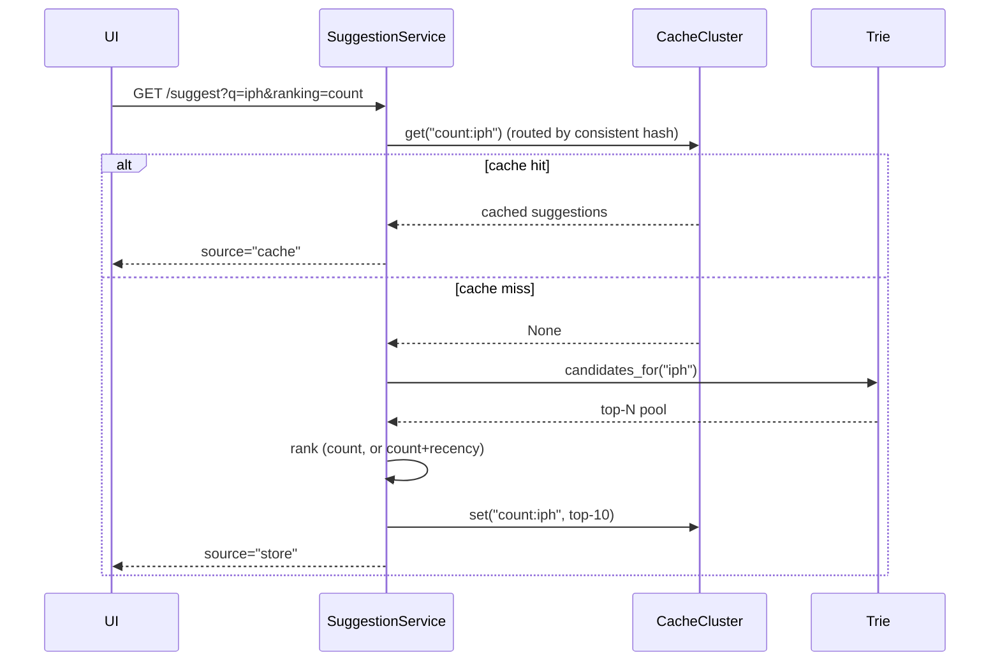
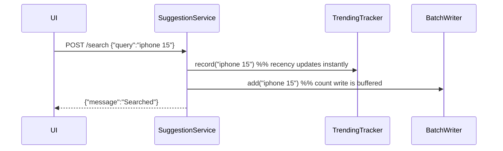
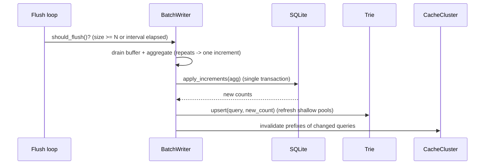

# Architecture

This document explains the data‑system design behind the Search Typeahead
System: the components, the data model, the read/write/flush flows, and the two
ranking modes.

## 1. Component diagram



## 2. Data model

**Primary store (SQLite), `queries` table** — durable source of truth:

| column | type | notes |
|---|---|---|
| `query` | TEXT PRIMARY KEY | normalised (trimmed, lower‑cased) |
| `count` | INTEGER | total search count (popularity) |
| `last_searched` | REAL | epoch seconds of last flush touching it |

**In‑memory Trie** — derived index for fast prefix lookups. Counts live on the
terminal node; shallow nodes (depth ≤ `precompute_depth`) carry a precomputed
top‑N candidate pool.

**TrendingTracker** — `query → (decaying_score, last_update_ts)` in memory.
Recency only; the durable popularity is the `count` above.

## 3. Read path — `GET /suggest`



Latency is recorded around this whole path and surfaced as p50/p95/p99 in
`/metrics`. Hot prefixes are served from cache; the consistent‑hash ring decides
which node holds each prefix so load spreads evenly across nodes.

## 4. Write path — `POST /search`



The count write is **not** done here — only buffered — so submission latency is
tiny and the DB is shielded from per‑search writes.

## 5. Flush path — background batch writer



This is where write reduction happens: 50 buffered "iphone" searches become a
single `count += 50` row‑write. `/metrics → batch_writes.write_reduction`
reports the ratio.

## 6. Consistent hashing (the distributed cache)

- The ring places `virtual_nodes` (default 150) points **per cache node** using
  `md5(node#i)`. A prefix key (`count:iph`) is hashed and assigned to the first
  node **clockwise** on the ring.
- Virtual nodes give an even key distribution and mean that **adding/removing a
  node only remaps ~1/N of keys**, not all of them.
- `GET /cache/debug?prefix=…` returns the owning node, the key hash, the matched
  virtual‑node position and whether it is currently a hit — so the routing
  decision is observable. The UI's "Cache routing" panel shows this live.
- `CacheCluster.key_distribution(sample)` can prove even spread across nodes.

## 7. Two ranking modes (trending)

- **Basic (`ranking=count`)** — order matching completions by overall `count`.
  Historically popular queries rank first. (Covers the 60% baseline.)
- **Enhanced (`ranking=recent`)** — `final = count + recency_weight · recency`,
  where `recency` is the exponentially decayed counter from `TrendingTracker`.
  Recently surging queries rise; because the recency term **decays**, a brief
  spike does not stay over‑ranked forever. (Covers the +20%.)

Demonstrate the difference: switch the UI's ranking toggle to *Recency‑aware*,
search a mid‑popularity query several times, and watch it climb above
higher‑count neighbours — then drift back down over the next few minutes as the
recency decays.

## 8. Mapping to the suggested milestones

1. **Load dataset + basic suggestion API** — `dataset.py`, `loader.py`,
   `store.py`, `trie.py`, `GET /suggest`.
2. **Frontend search box + dropdown** — `frontend/`.
3. **Search submission + query‑count updates** — `POST /search`, `service`,
   `store.apply_increments`.
4. **Distributed cache with consistent hashing** — `consistent_hash.py`,
   `cache.py`, `cache_cluster.py`, `GET /cache/debug`.
5. **Trending searches** — `trending.py`, `ranking=recent`, `GET /trending`.
6. **Batch writes** — `batch_writer.py`, background flush loop.
7. **Measure performance + docs/demo** — `metrics.py`, `GET /metrics`,
   `scripts/benchmark.py`, this document, `PERFORMANCE.md`.
```
